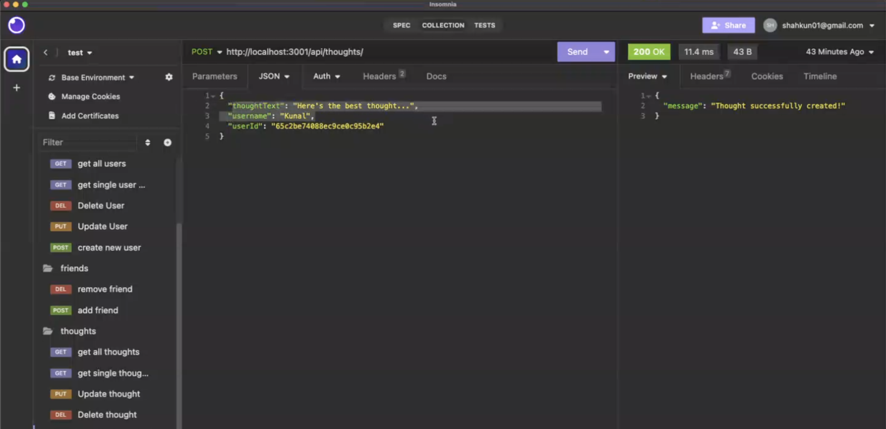

# Social Network API 

[](https://opensource.org/licenses/MIT)

## Table of Contents
* [Description](#description)
* [Installation](#installation)
* [Usage](#usage)
* [Technologies](#technologies)
* [Screenshots](#screenshots)
* [License](#license)
* [Author](#author)

## Description

This is a demonstration of MongoDB for a social network API. The functionality of this is to show how we can add, delete, update and create things such as users, friends and even reactions. There is a video walkthrough which shows how this application functions. 

🚀Video Walkthrough:  https://app.screencastify.com/v3/watch/GfXURs9RP6vAqM8RXtXb

The URL of the GitHub repository is https://github.com/unfazedxx/Social_Network_API

## Installation

- To install using the code found in the repository, follow these steps:
    - clone the repository using your CLI (the integrated terminal)
    - Once cloned, install the dependencies using (npm i) in the CLI 
    - After the repository has been cloned, type (npm start) in the CLI
    - Applciation can be used via Insomnia     

## Usage

## User Story

```md
AS A social media startup
I WANT an API for my social network that uses a NoSQL database
SO THAT my website can handle large amounts of unstructured data
```

## Acceptance Criteria

```md
GIVEN a social network API
WHEN I enter the command to invoke the application
THEN my server is started and the Mongoose models are synced to the MongoDB database
WHEN I open API GET routes in Insomnia for users and thoughts
THEN the data for each of these routes is displayed in a formatted JSON
WHEN I test API POST, PUT, and DELETE routes in Insomnia
THEN I am able to successfully create, update, and delete users and thoughts in my database
WHEN I test API POST and DELETE routes in Insomnia
THEN I am able to successfully create and delete reactions to thoughts and add and remove friends to a user’s friend list
```

## Technologies
Main technologies used in this application:
- MongoDB
- Mongoose
- Express


## Screenshots


## License

[](https://opensource.org/licenses/MIT)

This project is licensed under the terms of the MIT license.

## Author

I hope you enjoyed viewing my personal web portfolio. This project was super fun and in depth. I am happy to have a solid application to show future employers.

If you have further questions or wish to see the other projects I have completed, please visit my Github repository here: [Kunal's Github](https://github.com/unfazedxx).

You can also reach out via email at: 
<a href="mailto:shahkun02@gmail.com">shahkun01@gmail.com</a>

Or on LinkedIn at: <a href= "https://www.linkedin.com/in/shahkun01/">Kunal's LinkedIn</a>

Happy coding 😊
